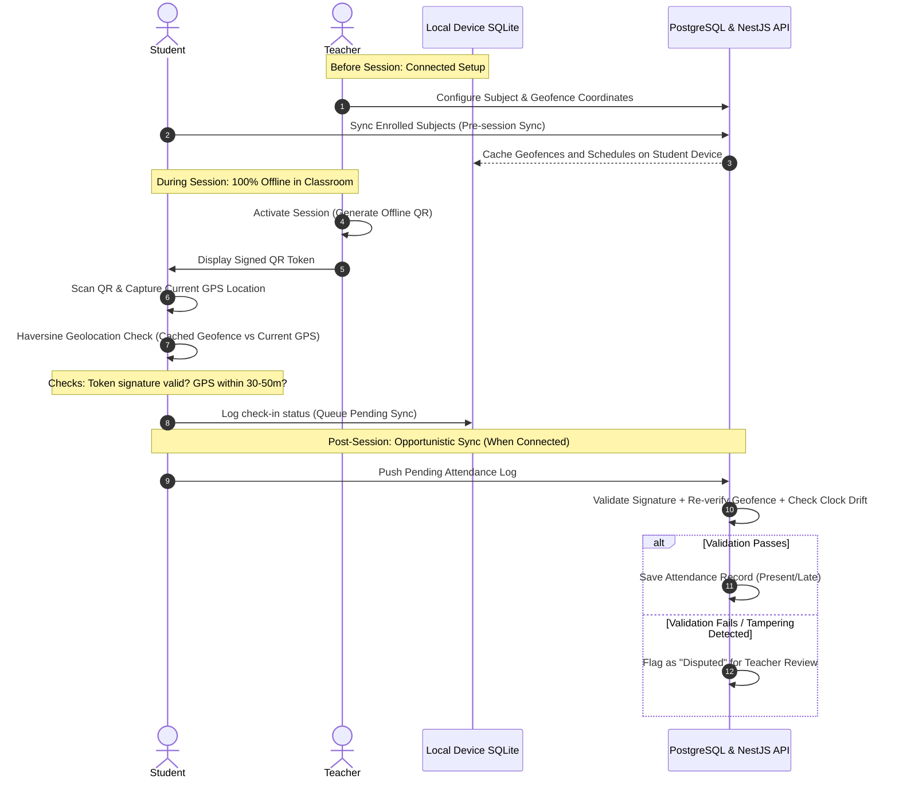

# Polycheck 🎓

> **Unified Attendance Management System with Geolocation Gating & Cryptographic Verification**
>
> A Capstone Project for the **Polytechnic University of the Philippines (PUP)**.

---

[](https://www.pup.edu.ph/)
[](https://typescriptlang.org)
[](https://turbo.build/)

---

## 📌 Project Goal & Vision

**Polycheck** is a secure, offline-first attendance management system designed specifically for the **Polytechnic University of the Philippines (PUP)**. 

The primary goal of this capstone project is to replace the traditional, manual, and paper-based class monitoring forms (F-1/F-2 equivalent) used by faculty and department leads. Manual tracking is highly vulnerable to proxy signing ("attendance cheating"), lost paper sheets, manual calculation errors, and lack of real-time visibility. 

Polycheck solves this by introducing a robust digital ecosystem that works **completely offline in classrooms** and features a multi-layered anti-cheat system including cryptographically signed QR tokens, client-side geolocation validation, and server-side verification.

### Problem vs. Solution

| Challenge in Paper-Based Monitoring | Polycheck Digital Solution |
| :--- | :--- |
| **Proxy Attendance** (Classmates signing for absent students) | Cryptographic QR tokens expiring in 2–5 minutes + Geolocation gating. |
| **Connectivity Dead Zones** (Unreliable campus WiFi/mobile data) | **Offline-First Architecture**: QR scanning and coordinate gating execute locally without network access. |
| **Credential & Account Sharing** | Device-bound sessions (single active session enforcement via Better Auth). |
| **GPS Coordinate Spoofing** | Plausibility checks and server-side geofence re-validation on sync. |
| **Manual Data Consolidation** | Real-time automated dashboards for Teachers and Super Admins (Department Heads). |

---

## 📐 System Architecture

Polycheck uses a custom **Offline-First** model. Because PUP's classrooms have thick concrete walls and spotty cellular connectivity, the system does not require internet for classroom checking-in.

### Offline Scan & Sync Architecture Flow



---

## 🛡️ Anti-Cheat System (v1)

| Threat Vector | Security Control | Action / Mechanics |
| :--- | :--- | :--- |
| **Sharing QR Screenshots** | **Short Expiry Window** | QR code regenerates and expires in 2–5 minutes. Re-validation checks the signed `issuedAt` timestamp, not the device clock. |
| **Scanning from Home** | **Geolocation Gate** | Students must be within a 30m–50m radius of the classroom geofence. Checked locally via Haversine calculation, re-verified on the server. |
| **Credential Sharing** | **Single Session Constraint** | Enforced by Better Auth. Logging in on a friend's phone immediately terminates the student's own active session. |
| **GPS Spoofing Apps** | **Plausibility Auditing** | Detects and flags overly precise coordinates matching the geofence center exactly, or static GPS readings across different class sessions. |

---

## 🎨 PUP Brand Design System

Polycheck adheres strictly to the official brand guidelines of the **Polytechnic University of the Philippines**:

*   **Primary Maroon** (`#7B1113`): Buttons, navigation bars, active headers, and primary branding states.
*   **Deep Maroon** (`#4A0A0B`): Dark mode cards, sidebar backgrounds, and hover/pressed states.
*   **Golden Yellow** (`#FFDF00`): Derived from the star in the PUP logo, used for highlights, badges, and CTAs.
*   **Light Base** (`#FFFFFF`): Clean backgrounds and card layouts.
*   **Dark Base** (`#0A0A0A`): Low-strain near-black theme base.
*   **Typography Display**: `Lora` (academic serif font via Google Fonts).
*   **Typography Body**: `DM Sans` (clean, highly-readable sans-serif).

---

## 📂 Repository Structure

The project is structured as a **Turborepo monorepo** managed with `pnpm workspaces`:

```
polycheck/
├── shared/                 # Shared TypeScript Package (@polycheck/shared)
│   └── src/
│       ├── types/          # Shared domain type definitions (Session, User, etc.)
│       ├── validation/     # Zod schema definitions for form validation
│       └── utils/          # Geometry models (Haversine formula), token decoders
├── frontend/               # Next.js 15 Web Dashboard
│   └── src/
│       ├── app/            # App Router pages (Faculty & Super Admin panels)
│       └── components/     # UI Components built using shadcn/ui
├── android/                # Expo React Native App (for Students & Offline Faculty)
│   └── src/
│       ├── app/            # Expo Router file-based screens
│       ├── components/     # Mobile components (styled via NativeWind)
│       └── services/       # SQLite db schemas, sync queue engine, mock APIs
├── backend/                # NestJS API backend (to be fully integrated in v2)
├── documentation/          # Academic project reports, system specifications
└── package.json            # Turborepo workspace configurations
```

---

## ⚙️ Project Setup & Installation

Follow these steps to set up the developer workspace on your local machine:

### Prerequisites
Make sure you have the following installed:
*   [Node.js](https://nodejs.org/) (v18.x or higher)
*   [pnpm](https://pnpm.io/) (v9.x or higher is recommended)
*   [Expo Go](https://expo.dev/client) app installed on your physical mobile device, or Android Studio/Xcode simulators.

### Setup Instructions

1.  **Clone the Repository**
    ```bash
    git clone https://github.com/AddToKart/polycheck.git
    cd polycheck
    ```

2.  **Install Monorepo Dependencies**
    Execute the command in the workspace root. `pnpm` will automatically install and link all workspace packages (`@polycheck/shared`, `frontend`, `android`, etc.):
    ```bash
    pnpm install
    ```

3.  **Build the Shared Package**
    Build the types, schemas, and utility functions that both the mobile and web frontends rely on:
    ```bash
    pnpm --filter @polycheck/shared build
    ```

---

## 🚀 Running the Applications

Turborepo handles task orchestration. You can run all development services concurrently or run target workspaces independently.

### Running Everything in Development Mode
To start the Next.js web application, the Expo dev server, and watch the shared package simultaneously:
```bash
pnpm dev
```

### Running Target Packages Separately

*   **Next.js Web Dashboard (Faculty & Admin)**
    ```bash
    pnpm --filter frontend dev
    ```
    Access the dashboard locally at `http://localhost:3000`.

*   **Expo Mobile App (Student Attendance scanner)**
    ```bash
    pnpm --filter android start
    ```
    Press `a` to open the Android emulator, `i` for iOS, or scan the QR code using your **Expo Go** app.

*   **Shared Library Compiler (Watches changes)**
    ```bash
    pnpm --filter @polycheck/shared dev
    ```

### Production Build & Linting

*   **Build all applications:**
    ```bash
    pnpm build
    ```
*   **Lint the entire monorepo:**
    ```bash
    pnpm lint
    ```

---

## 🎓 Capstone Context
*   **Institution:** Polytechnic University of the Philippines (PUP)
*   **Project Name:** Polycheck Attendance System
*   **Target Users:** PUP Department Chairs (Super Admin), PUP Faculty Members (Admin), PUP Students (User)
*   **Target Platforms:** Responsive web dashboard (teachers & department heads) and native mobile apps (students scanning QR codes in classrooms).
*   **Academic Year:** 2026

---

*Made with ❤️ by the Polycheck Capstone Development Team.*
