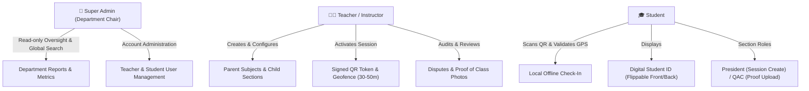
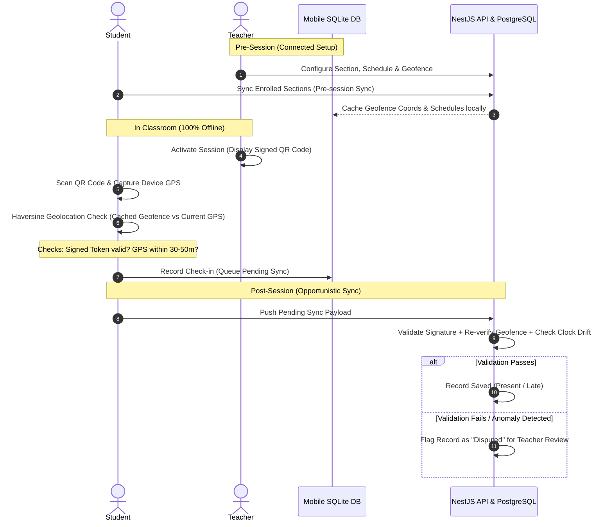

# Polycheck 🎓

> **Unified Attendance Management System with Geolocation Gating & Cryptographic Verification**
>
> A Capstone Project for the **Polytechnic University of the Philippines (PUP)**.

---

[](https://www.pup.edu.ph/)
[](https://typescriptlang.org)
[](https://turbo.build/)
[](https://www.docker.com/)

---

## 📌 Project Goal & Vision

**Polycheck** is a secure, offline-first attendance management ecosystem designed specifically for the **Polytechnic University of the Philippines (PUP)**. 

The primary goal of this capstone project is to replace traditional, manual, and paper-based class monitoring forms (F-1/F-2 equivalent) used by faculty and department chairs. Manual tracking in large university settings is vulnerable to proxy signing ("attendance cheating"), lost paper sheets, manual calculation errors, lack of real-time visibility, and cellular dead zones in concrete campus buildings.

Polycheck solves this by introducing a robust digital platform that operates **100% offline inside classrooms** and features a multi-layered anti-cheat system powered by cryptographically signed QR tokens, client-side geolocation validation, and server-side verification upon sync.

### Problem vs. Solution

| Challenge in Paper-Based Monitoring | Polycheck Digital Solution |
| :--- | :--- |
| **Proxy Attendance** (Classmates signing for absent friends) | Cryptographic QR tokens with dynamic expiry (1–180 min) + Geolocation gating. |
| **Connectivity Dead Zones** (Unreliable campus WiFi/mobile data) | **Offline-First Architecture**: QR scanning and coordinate gating execute locally without network access. |
| **Credential & Account Sharing** | Single active session enforcement via Better Auth + binding to digital student IDs. |
| **GPS Coordinate Spoofing** | Plausibility checks and server-side geofence re-validation on sync. |
| **Manual Data Consolidation** | Real-time automated dashboards for Teachers and Super Admins (Department Heads). |
| **Classroom Meeting Verification** | **Proof of Class**: QAC student officers upload timestamped classroom photos for audit. |

---

## 🛠️ Complete Technology Stack

| Layer | Technology | Key Capabilities & Libraries |
| :--- | :--- | :--- |
| **Monorepo Architecture** | `pnpm` workspaces + `Turborepo` | Workspace isolation, fast cached builds, shared package compilation. |
| **Shared Library** | `@polycheck/shared` | TypeScript domain types, Zod schemas, Haversine formula, token decoders. |
| **Web Application** | Next.js 15 (App Router), React 19 | shadcn/ui, Tailwind CSS v4, Lucide Icons, MapLibre GL, standalone output. |
| **Mobile Application** | Expo SDK 52+, Expo Router v4 | NativeWind v4, react-native-reusables, expo-sqlite, expo-location, expo-camera. |
| **Backend API** | NestJS 11 (Node.js 22) | Prisma ORM 5.22, Socket.IO WebSockets, Better Auth, Pino logging, Prometheus metrics. |
| **Database & Caching** | PostgreSQL 16 & Redis 7.4 | PgBouncer transaction connection pooling, Redis Pub/Sub adapter, BullMQ async queues. |
| **Edge & Proxy** | Nginx 1.28 (Unprivileged) | Reverse proxy, TLS termination, path routing, health checks. |
| **Monitoring** | Prometheus v3.5 | Real-time metric scraping (`/api/metrics`), health & dependency readiness probes. |

---

## 👥 User Roles & Access Control

Polycheck implements strict Role-Based Access Control (RBAC) across three distinct user roles:


```mermaid
graph TD
    SuperAdmin["👑 Super Admin (Department Chair)"] -->|Read-only Oversight & Global Search| Reports["Department Reports & Metrics"]
    SuperAdmin -->|Account Administration| UserMgmt["Teacher & Student User Management"]

    Teacher["👨‍🏫 Teacher / Instructor"] -->|Creates & Configures| CourseModel["Parent Subjects & Child Sections"]
    Teacher -->|Activates Session| SessionActivation["Signed QR Token & Geofence (30-50m)"]
    Teacher -->|Audits & Reviews| ReviewPanel["Disputes & Proof of Class Photos"]

    Student["🎓 Student"] -->|Scans QR & Validates GPS| AttendanceScan["Local Offline Check-In"]
    Student -->|Displays| DigitalID["Digital Student ID (Flippable Front/Back)"]
    Student -->|Section Roles| OfficerRole["President (Session Create) / QAC (Proof Upload)"]
```

### 1. Super Admin (Department Chairs & PUP Officials)
- **Institutional Oversight**: Global read-only search across all subjects, sections, sessions, and attendance summaries.
- **User Administration**: Creation, updates, password resets, and status management for Teacher and Student accounts.
- **Department Analytics**: Department-wide attendance statistics, anomaly trends, and exportable reports.

### 2. Teacher / Instructor (Classroom Managers)
- **Course Management**: Manages Parent Subjects (e.g. `CCIS 3104`) and Child Sections (e.g. `Section A`, Room `CCIS Lab 3`).
- **Enrollment Control**: Set per-section enrollment codes with expiration dates or manual student additions.
- **Session Activation**: Generate dynamic QR codes (1–180 min validity + grace period) and configure map geofences (30m–50m radius).
- **Dispute & Audit Panel**: Review disputed attendance records (Accept as Present, Reject as Absent, Manual Override) and review proof-of-class photo submissions.

### 3. Student (Mobile App & ID Holder)
- **Digital Student ID**: Physical card layout featuring PUP maroon header, student photo, details, and a flippable back face showing magnetic stripe, emergency contacts, and QR code.
- **Offline Attendance Check-In**: Scan QR code in classroom; app checks GPS against cached geofence locally.
- **Section Roles**: Student officers (President, QAC) can create sessions or upload proof-of-class photos.
- **Automatic Sync**: Offline records queue locally in SQLite and automatically push to the server upon internet connection.

---

## 📐 System Architecture & Offline-First Flow

Polycheck is engineered for **100% offline classroom execution**. Students do not need internet connection during class to scan QR codes or verify coordinates.


```mermaid
sequenceDiagram
    autonumber
    actor Student
    actor Teacher
    participant LocalDB as Mobile SQLite DB
    participant Server as NestJS API & PostgreSQL

    Note over Teacher, LocalDB: Pre-Session (Connected Setup)
    Teacher->>Server: Configure Section, Schedule & Geofence
    Student->>Server: Sync Enrolled Sections (Pre-session Sync)
    Server-->>LocalDB: Cache Geofence Coords & Schedules locally

    Note over Teacher, Student: In Classroom (100% Offline)
    Teacher->>Teacher: Activate Session (Display Signed QR Code)
    Student->>Student: Scan QR Code & Capture Device GPS
    Student->>Student: Haversine Geolocation Check (Cached Geofence vs Current GPS)
    Note over Student: Checks: Signed Token valid? GPS within 30-50m?
    Student->>LocalDB: Record Check-in (Queue Pending Sync)

    Note over Student, Server: Post-Session (Opportunistic Sync)
    Student->>Server: Push Pending Sync Payload
    Server->>Server: Validate Signature + Re-verify Geofence + Check Clock Drift
    alt Validation Passes
        Server->>Server: Record Saved (Present / Late)
    else Validation Fails / Anomaly Detected
        Server->>Server: Flag Record as "Disputed" for Teacher Review
    end
```

---

## 🛡️ Anti-Cheat System (v1)

| Threat Vector | Security Control | Technical Mechanics |
| :--- | :--- | :--- |
| **Sharing QR Screenshots** | **Dynamic Signed Tokens** | QR code carries signed `issuedAt` timestamp + validity duration. Expiry checks payload timestamp, not local device clocks. |
| **Scanning from Home** | **Haversine Geofence Gate** | Requires GPS location within a 30m–50m circular radius of classroom. Evaluated client-side, re-validated server-side. |
| **Account / Phone Sharing** | **Single Session Constraint** | Enforced by Better Auth. Logging into an account on another phone immediately terminates previous active sessions. |
| **GPS Spoofing Apps** | **Plausibility Auditing** | Flags exact static GPS matches across different sessions or coordinates with zero jitter for teacher review. |
| **Proxy Class Meetings** | **Proof of Class Photos** | Authorized QAC student officers capture and upload timestamped classroom photos during active sessions. |

---

## 🎨 PUP Brand Design System

Polycheck adheres strictly to the official brand guidelines of the **Polytechnic University of the Philippines**:

*   **Primary Maroon** (`#7B1113`): Buttons, active navigation headers, primary branding states.
*   **Deep Maroon** (`#4A0A0B`): Dark mode cards, sidebar backgrounds, hover/pressed states.
*   **Golden Yellow** (`#FFDF00`): Derived from the star in the PUP logo, used for highlights, badges, and CTAs.
*   **Light Base** (`#FFFFFF`): Clean backgrounds and light mode card layouts.
*   **Dark Base** (`#0A0A0A`): Low-strain near-black dark mode base.
*   **Typography Display**: `Lora` (academic serif font via Google Fonts).
*   **Typography Body**: `DM Sans` (clean, highly-readable sans-serif).

---

## 📂 Monorepo Repository Structure

```
polycheck/
├── shared/                 # Shared TypeScript Package (@polycheck/shared)
│   └── src/
│       ├── types/          # Domain models (User, Subject, Section, Session, Attendance)
│       ├── validation/     # Zod validation schemas (SubjectCreate, SectionCreate, etc.)
│       ├── map/            # Map utilities and bounding box algorithms
│       └── utils/          # Haversine distance calculator, QR token signers/decoders
├── frontend/               # Next.js 15 Web Dashboard (@polycheck/frontend)
│   └── src/
│       ├── app/            # App Router pages (Faculty, Admin & Student dashboards)
│       ├── components/     # UI Components built using shadcn/ui & Tailwind CSS
│       └── lib/            # API client, WebSockets, Better Auth state
├── android/                # Expo React Native App (@polycheck/android)
│   └── src/
│       ├── app/            # Expo Router screens (Tabs, Scan, ID Card, Subject Info)
│       ├── components/     # Mobile UI styled via NativeWind v4 & react-native-reusables
│       └── services/       # SQLite database, sync engine, location & camera services
├── backend/                # NestJS API Backend (@polycheck/backend)
│   ├── src/
│   │   ├── auth/           # Better Auth strategies, RBAC guards
│   │   ├── attendance/     # Check-in engine, geofence verification
│   │   ├── sessions/       # QR token generation, activation, expiration
│   │   ├── sections/       # Section CRUD, enrollment codes, rosters
│   │   ├── subjects/       # Course-level parent subject management
│   │   ├── disputes/       # Dispute review & manual override workflow
│   │   ├── proofs/         # Proof-of-class photo uploads & storage
│   │   ├── realtime/       # Socket.IO WebSocket gateway & Redis adapter
│   │   └── health/         # Liveness and readiness dependency probes
│   └── prisma/             # PostgreSQL Schema, migrations, & seed scripts
├── deployment/             # Nginx reverse proxy & Prometheus monitoring configurations
├── documentation/          # System specs, architecture plans, & load test reports
├── Dockerfile.backend      # Multi-stage optimized Node 22 Alpine backend Dockerfile
├── Dockerfile.frontend     # Multi-stage optimized Next.js 15 standalone Dockerfile
├── docker-compose.yml      # Production stack (PgBouncer, Redis, Nginx, Prometheus)
└── docker-compose.local.yml # Isolated local developer stack
```

---

## ⚙️ Quick Start & Developer Setup

### Prerequisites
Make sure you have the following installed:
*   [Node.js](https://nodejs.org/) (v18.x or higher)
*   [pnpm](https://pnpm.io/) (v9.x or higher)
*   [Docker Desktop](https://www.docker.com/products/docker-desktop/) (with Compose v2)
*   [Expo Go](https://expo.dev/client) app installed on your phone, or Android Studio / iOS Simulator.

---

### 🚀 Running Local Docker Stack

#### Option A: 1-Shot Onboarding Command (Recommended)
Set up, build, migrate, and seed the entire local stack in **1 single command**:

```bash
pnpm docker:local:setup
```

#### Option B: Step-by-Step Commands
```bash
# 1. Start containers & apply database migrations
pnpm docker:local:up

# 2. Seed mock test database records
pnpm docker:local:seed
```

Open `http://localhost:3000/login` to log into the web dashboard!

---

### 🔑 Seed Test Accounts

All seeded accounts use the default password: **`PolycheckLocal1!`**

| Role | Email / Student ID | Description |
| :--- | :--- | :--- |
| **Super Admin** | `mcreyes@pup.edu.ph` | Dr. Maria Concepcion Reyes (CCIS Department Chair) |
| **Teacher** | `jmdelacruz@pup.edu.ph` | Prof. Juan Miguel Dela Cruz (CCIS Faculty) |
| **Student** | `2024-00001-MN-0` | Alexandra Marie Reyes (BS Computer Science) |

---

### 📱 Connecting Android Mobile App to Local Stack

Keep your Docker stack running while launching the mobile app outside Docker:

#### 1. Android Studio Emulator
The emulator automatically connects to the backend at `http://10.0.2.2:4000/api`.
```bash
pnpm --filter android start
```
Press `a` to open the Android emulator.

#### 2. Physical Phone (over Campus / Home WiFi)
Set your computer's local LAN IP address and start Expo:
```powershell
$env:EXPO_PUBLIC_API_URL="http://192.168.1.10:4000/api"
pnpm --filter android start
```
*(Replace `192.168.1.10` with your machine's actual local IPv4 address).*

---

### 💻 Native Host Development (Without Docker)

If you prefer running Node.js directly on your machine without Docker containers:

```bash
# 1. Install workspace dependencies
pnpm install

# 2. Build the shared package
pnpm --filter @polycheck/shared build

# 3. Start Next.js, Expo, and shared compiler concurrently
pnpm dev
```

---

## 📜 Monorepo NPM Command Reference

| Command | Description |
| :--- | :--- |
| `pnpm docker:local:setup` | **1-Shot**: Builds, migrates, and seeds the entire local Docker stack. |
| `pnpm docker:local:up` | Starts or rebuilds local Docker containers (retains database data). |
| `pnpm docker:local:seed` | Runs the database seed tool to populate sample records. |
| `pnpm docker:local:logs` | Streams live logs from all running local Docker containers. |
| `pnpm docker:local:down` | Stops local Docker containers. |
| `pnpm dev` | Starts all monorepo workspaces in development watch mode. |
| `pnpm build` | Compiles production builds for all workspace packages. |
| `pnpm lint` | Executes ESLint across all workspace apps and packages. |
| `pnpm load:attendance:smoke` | Runs k6 smoke load test against attendance check-in endpoints. |
| `pnpm load:attendance:full` | Runs k6 full load test against attendance check-in endpoints. |

---

## 🎓 Capstone Project Context
*   **Institution:** Polytechnic University of the Philippines (PUP)
*   **Project Name:** Polycheck Attendance System
*   **Target Users:** PUP Department Chairs (Super Admin), PUP Faculty Members (Admin), PUP Students (User)
*   **Target Platforms:** Responsive Web Dashboard (Teachers & Chairs) and Native Mobile Apps (Students & Classroom Scanners).
*   **Academic Year:** 2026

---

*Made with ❤️ by the Polycheck Capstone Development Team.*
